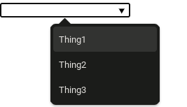

---
{
    title: "HTML Select Uses",
    description: "An introduction to HTML's input:list and select boxes.",
    published: '2024-03-06',
    authors: ['jerico'],
    tags: ['select', 'javascript'],
    license: 'cc-by-4',
    originalLink: ""
}
---

In this short article, I will introduce you to HTML’s Input:List and DataList elements/attributes. 

I will also cover their functionality, introduce bits of JavaScript, and then show how to expand on this.

##  Elements And Order

`List` is an input attribute that allows a person to select boxes and values for a user to select themselves. You specify where the list is getting its data or options from bypassing the `Id` of a `dataList` element into it. Then in the dataList element, you put your `option` element with the attribute of `value` to give the value of the select box or input (the return).

Here is a starting example using `Input`, `datalist`, and `option` elements.

```
<input list=”optionsList”>

<datalist id=”optionsList”>
	<option value=”Thing1”> <!--Option element does not need closing tag (</option>)-->
	<option value=”Thing2”>
	<option value=”Thing3”>
</datalist>
```

In the example above I give `Thing#` as one of the options. If you were a user trying to select one of these options it would look something like this.

 

## Reasonable Use 

Why would I use this in my own work? The reason is, that it has functionality and allows you to only get back the values you want. For example, If you wanted to have a list of Zipcodes that a user could select from instead of having them type their Zipcode.

Note: A user still can type in this `input:list` box but all that does is search all the options for you and give you the ones that you can select.

## Simple Application

In the note before this section, I mentioned how “A user still can type in this `input:list` box but all that does is search all the options for you and give you the remaining ones that you can select”.  With that in mind, I want to show how you can return the remaining options in the input with `JavaScript`. 

The code will have comments, so there is no further explanation. The example below is an expansion on the ZipCodes example.
JsFiddle for quick viewing https://jsfiddle.net/dek12pgj/. 

Html:
```html
<input id="zip" list="zipcodes" name="zip" oninput="validate()">
<datalist id="zipcodes">
	<option value="1320">
	<option value="1101>
	<option value="1890">
 </datalist> 
```

Js:
```
let optionValues = document.getElementById("zipcodes").children;
let optionsRemaining = [];

//Getting all options
for (let i = 0; i < optionValues.length; i++) {
  let x = optionValues[i].getAttribute("value"); //Getting options value "1101, etc"
  optionsRemaining.push(x); //Putting them into an array
}
console.log(optionsRemaining);//Logging them on start

//function to find remaining Zipcodes
function validate() {
  //Using a for loop to check through the whole array and return
  for (let i = 0; i < optionsRemaining.length; i++) {
    //Getting input value
    let itemStringValue = document.getElementById("zip").value;
    //Checking if input value includes what other things don't or do.
    if (optionsRemaining[i].includes(itemStringValue)) {
      //logging remaining data that can be selected.
      console.log("Remained: " + optionsRemaining[i]);
    }
   //A divider so the console is clean (It's bad without)
   console.log("---------------");
  }
}
```

HTML’s input has many unique uses, I hope you learned something, and have a nice day! :)

